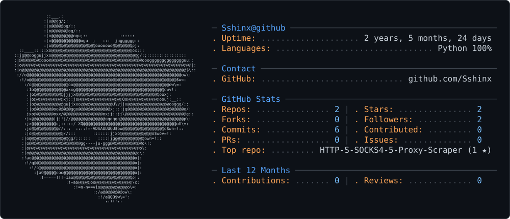

<picture>
  <source media="(prefers-color-scheme: dark)" srcset="src/dark_mode.svg" />
  <source media="(prefers-color-scheme: light)" srcset="src/light_mode.svg" />
  
</picture>

 

<picture>
  <source media="(prefers-color-scheme: dark)" srcset="src/CentraleSupélec.svg" />
  <source media="(prefers-color-scheme: light)" srcset="src/CentraleSupélec.svg" />
  
</picture>

<h1>Sshinx

 

 

<h3 align="center">🛠️ Stack</h3>

<picture>
  <source media="(prefers-color-scheme: dark)" srcset="https://skillicons.dev/icons?i=py%2Cc%2Cmatlab%2Cpytorch%2Copencv%2Csklearn%2Cgit%2Clinux%2Clatex&theme=dark" />
  <source media="(prefers-color-scheme: light)" srcset="https://skillicons.dev/icons?i=py%2Cc%2Cmatlab%2Cpytorch%2Copencv%2Csklearn%2Cgit%2Clinux%2Clatex&theme=light" />
  
</picture>

  

 

---

<h3 align="center">📊 Stats GitHub</h3>

<table>
  <tr>
    <td align="center">
      <picture>
        <source media="(prefers-color-scheme: dark)" srcset="https://github-readme-stats-eight-theta.vercel.app/api?username=Sshinx&show_icons=true&include_all_commits=true&hide_border=true&locale=fr&bg_color=0d1117&title_color=e3456f&icon_color=a395b0&text_color=c9d1d9" />
        <source media="(prefers-color-scheme: light)" srcset="https://github-readme-stats-eight-theta.vercel.app/api?username=Sshinx&show_icons=true&include_all_commits=true&hide_border=true&locale=fr&bg_color=ffffff&title_color=b00739&icon_color=8c7a99&text_color=24292f" />
        
      </picture>
    </td>
    <td align="center">
      <picture>
        <source media="(prefers-color-scheme: dark)" srcset="https://github-readme-stats-eight-theta.vercel.app/api/top-langs/?username=Sshinx&layout=compact&hide_border=true&locale=fr&bg_color=0d1117&title_color=e3456f&text_color=c9d1d9" />
        <source media="(prefers-color-scheme: light)" srcset="https://github-readme-stats-eight-theta.vercel.app/api/top-langs/?username=Sshinx&layout=compact&hide_border=true&locale=fr&bg_color=ffffff&title_color=b00739&text_color=24292f" />
        
      </picture>
    </td>
  </tr>
  <tr>
    <td align="center" colspan="2">
      <picture>
        <source media="(prefers-color-scheme: dark)" srcset="https://streak-stats.demolab.com?user=Sshinx&hide_border=true&locale=fr&background=0d1117&ring=e3456f&fire=e3456f&currStreakNum=c9d1d9&sideNums=c9d1d9&currStreakLabel=e3456f&sideLabels=a395b0&dates=8b949e&stroke=30363d" />
        <source media="(prefers-color-scheme: light)" srcset="https://streak-stats.demolab.com?user=Sshinx&hide_border=true&locale=fr&background=ffffff&ring=b00739&fire=b00739&currStreakNum=24292f&sideNums=24292f&currStreakLabel=b00739&sideLabels=8c7a99&dates=57606a&stroke=d0d7de" />
        
      </picture>
    </td>
  </tr>
</table>

 

